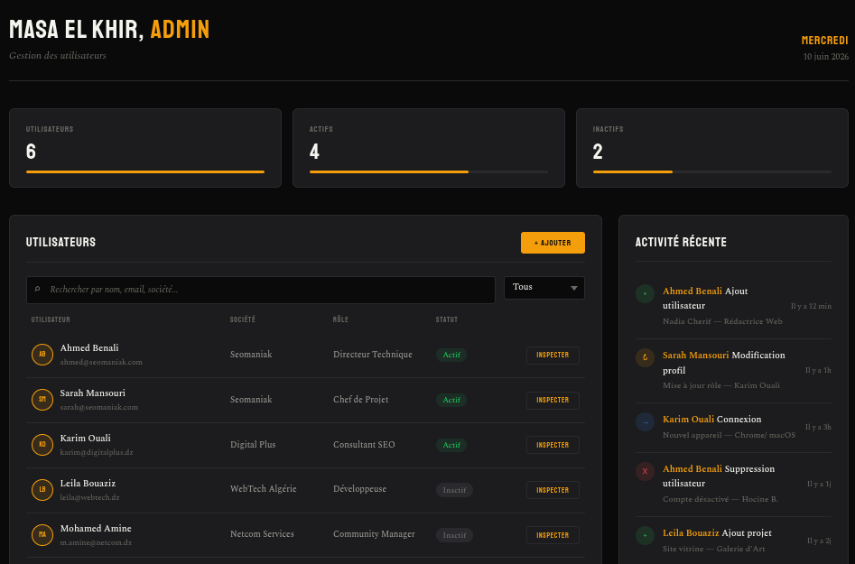
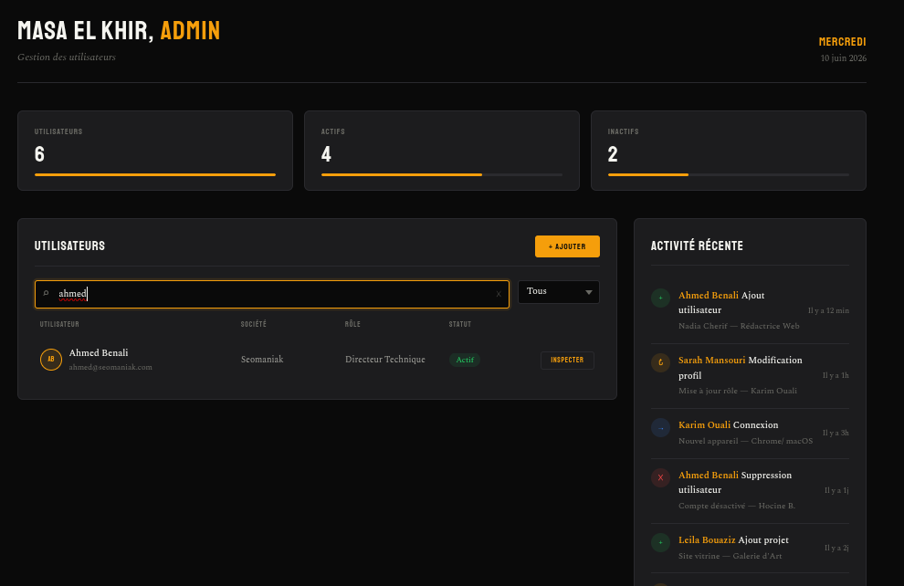
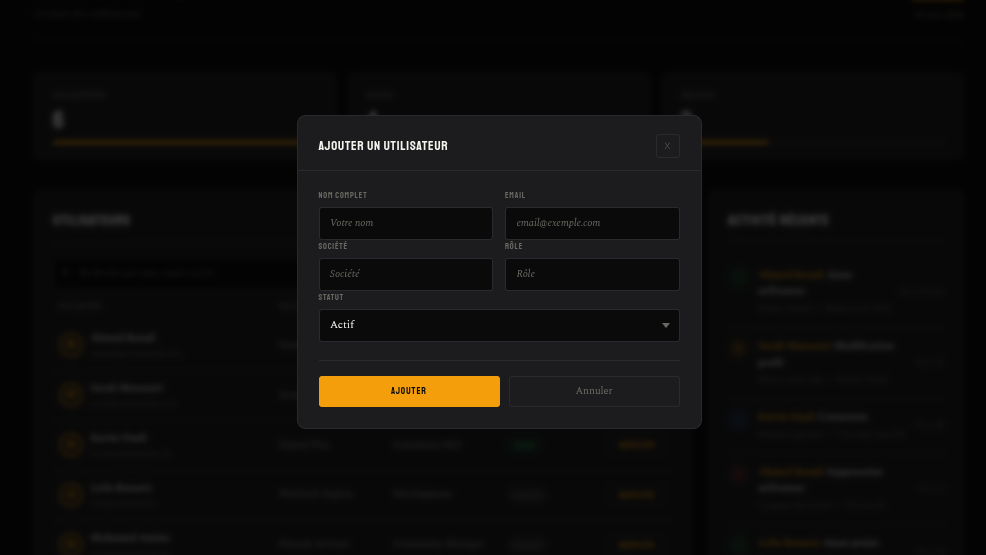
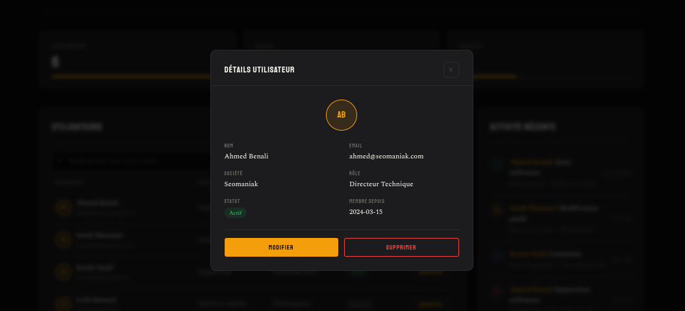
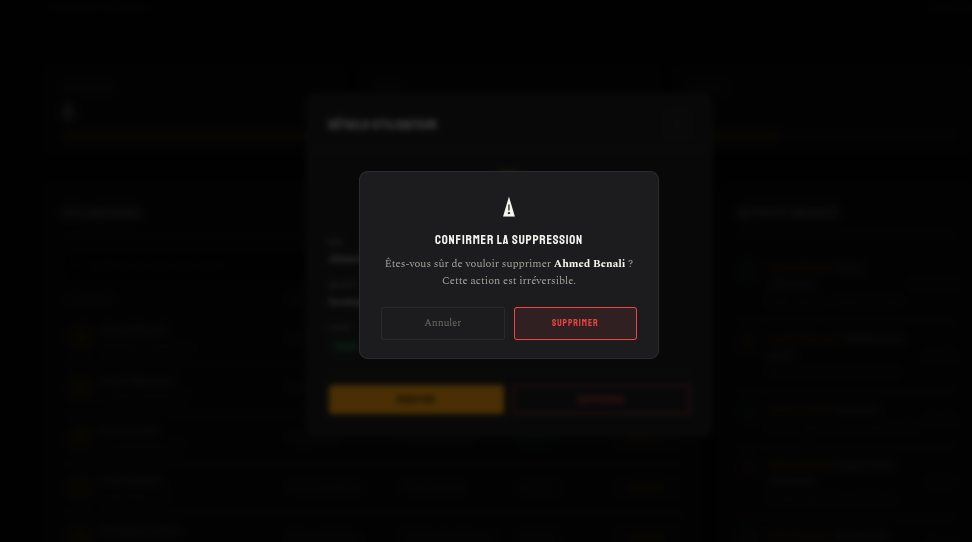

# Seomaniak Dashboard

Tableau de bord de gestion d'utilisateurs — interface sombre au style brutalist/éditorial.



## Stack

- **Vite** — build tool
- **React 19** — UI
- **JavaScript** (JSX)
- **CSS natif** — variables, animations, responsive

Pas de librairie UI externe. Tout le style est fait main.

## Fonctionnalités

- **Statistiques** — cartes avec total utilisateurs, actifs, inactifs
- **Liste utilisateurs** — tableau avec recherche par nom/email/société et filtre par statut
- **Inspecter** — affiche les détails d'un utilisateur
- **Ajouter / Modifier** — formulaire avec validation
- **Supprimer** — dialogue de confirmation custom
- **Feed activité** — historique des actions

## Structure

```
src/
├── App.jsx              # Layout principal + state management
├── App.css              # Styles globaux des composants
├── index.css            # Design system (variables, reset, fonts)
├── main.jsx             # Point d'entrée
├── components/
│   ├── DashboardHeader  # En-tête avec salutation horaire
│   ├── StatsCards       # Cartes statistiques
│   ├── UserList         # Tableau + barre de recherche/filtre
│   ├── UserModal        # Modal inspect / ajout / modification
│   ├── ConfirmDialog    # Confirmation de suppression
│   └── ActivityFeed     # Fil d'activité récente
└── data/
    └── users.js         # Données mock + types implicites
```

## Captures d'écran

| Recherche & Filtre | Ajout utilisateur |
|---|---|
|  |  |

| Inspection | Suppression |
|---|---|
|  |  |

## Lancer le projet

```bash
npm install
npm run dev
```
